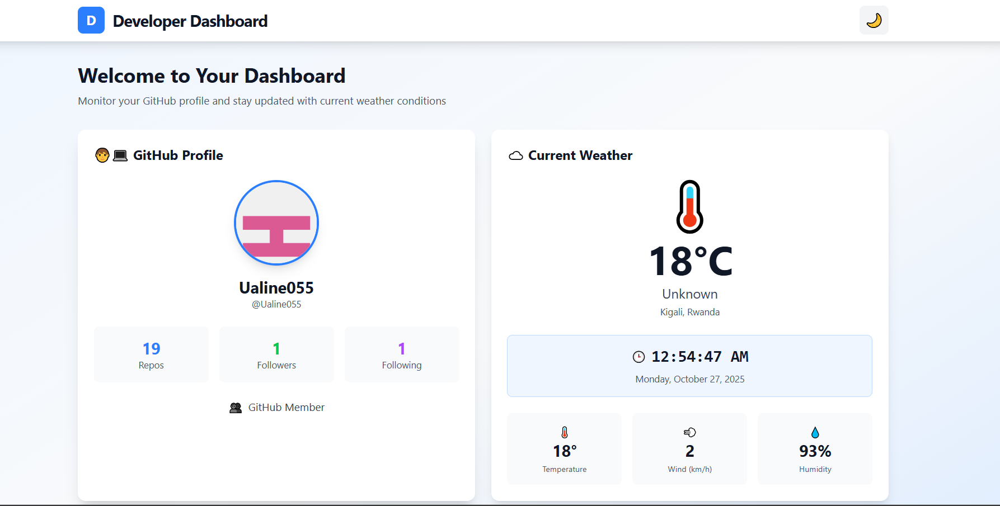

# Developer Dashboard

A modern, responsive developer dashboard built with React, Vite, and Tailwind CSS. Track your GitHub activity and local weather in real-time with a beautiful light/dark mode interface.

## 📋 APIs Used

1. **GitHub API**
   - Endpoint: `https://api.github.com/users/Ualine055`
   - No API key required
   - Rate limit: 60 requests per hour (unauthenticated)

2. **OpenWeatherMap API**
   - Endpoint: `https://api.open-meteo.com/v1/forecast?latitude=-1.9536&longitude=30.0606&current=temperature_2m,relative_humidity_2m,wind_speed_10m,weather_code&temperature_unit=celsius&wind_speed_unit=kmh&timezone=Africa%2FKigali`
   - Requires free API key from [Open-meteo.com]
   - Free tier: 1,000 calls per day

## 🛠️ Technologies Used

- **React 18** - UI library
- **Vite** - Build tool and development server
- **Tailwind CSS** - Utility-first CSS framework
- **Axios** - HTTP client for API requests
- **Context API** - State management for theme
- **OpenWeatherMap API** - Weather data
- **GitHub API** - Profile information

## 📸 Screenshots

### Light Mode

### Dark Mode

## Deployment Link
![ dev-dashboard-3us9xz2u9-ualine055-5515s-projects.vercel.app ]

## 🚀 Features

- **GitHub Profile Card**: Displays my GitHub profile information including:
  - Profile avatar
  - Number of repositories
  - Followers and following count
  - Location and website
  - Bio information

- **Weather Card**: Shows current weather conditions including:
  - Current temperature
  - Weather condition with emoji icons
  - Wind speed
  - Humidity levels
  - Min/Max temperatures
  - Real-time clock that updates every second

- **Light/Dark Mode Toggle**: Seamless theme switching with persistent preferences saved to localStorage

- **Responsive Design**: Fully responsive layout that works on mobile, tablet, and desktop devices

- **Error Handling**: Graceful error messages for API failures and network issues

- **Loading States**: Beautiful loading spinners while fetching data

## 🚀 Getting Started

### Prerequisites

- Node.js (v14 or higher)
- npm or yarn
- OpenWeatherMap API key (free)

### Installation

1. **Clone the repository**
   \`\`\`bash
   git clone https://github.com/Ualine055/dev-dashboard.git
   cd vite-project
   \`\`\`

2. **Install dependencies**
   \`\`\`bash
   npm install
   \`\`\`

5. **Run the development server**
   \`\`\`bash
   npm run dev
   \`\`\`

6. **Open your browser**
   
   Navigate to `http://localhost:5173`

## 📁 Folder Structure

---

developer-dashboard/
├── public/
├── src/
│   ├── components/
│   │   ├── GitHubCard.jsx        # GitHub profile card
│   │   ├── Navbar.jsx            # Navigation bar
│   │   └── WeatherCard.jsx       # Weather information card
│   ├── hooks/
│   │   └── useTheme.js       # Theme state management
│   ├── App.jsx                   # Main application component
│   ├── index.css                 # Global styles and Tailwind
│   └── main.jsx                  # Application entry point
├── index.html
├── package.json
├── postcss.config.js
├── tailwind.config.js
├── vite.config.js
└── README.md
---